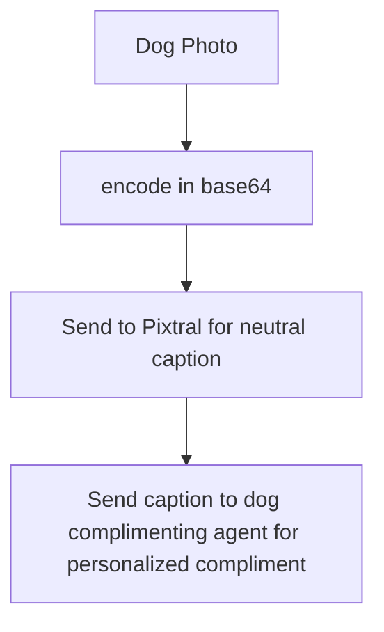

# dog-description-pipeline
Pipeline for taking in photographs of dogs and other animals, captioning with an LLM, and outputting dog compliments through a TTS model.

**TTS Module Not Yet Implemented**

The application takes as input photographs of dogs (other subjects will likely work as well, but parts are designed specifically with dog photos in mind), performs object detection and crops the images to a fixed size, encodes them in base64, and then uses a series of requests to the Mistral API to first describe the dog in the photo and then come up with a creative compliment that is personal and specific to the dog in the photo.

# Running the application

To run the application, first run the setup_environment.sh script. Then, activate the dog-description conda environment, place an image (or a few) in the input_photos directory, and run using either the run.sh script or incrementally by running preprocess.py, followed by encode.py, requests.py and then compliment.py (you may need to configure your own dog compliment agent for this). The neutral descriptions will be written to captions.json, and the compliments to responses.json.